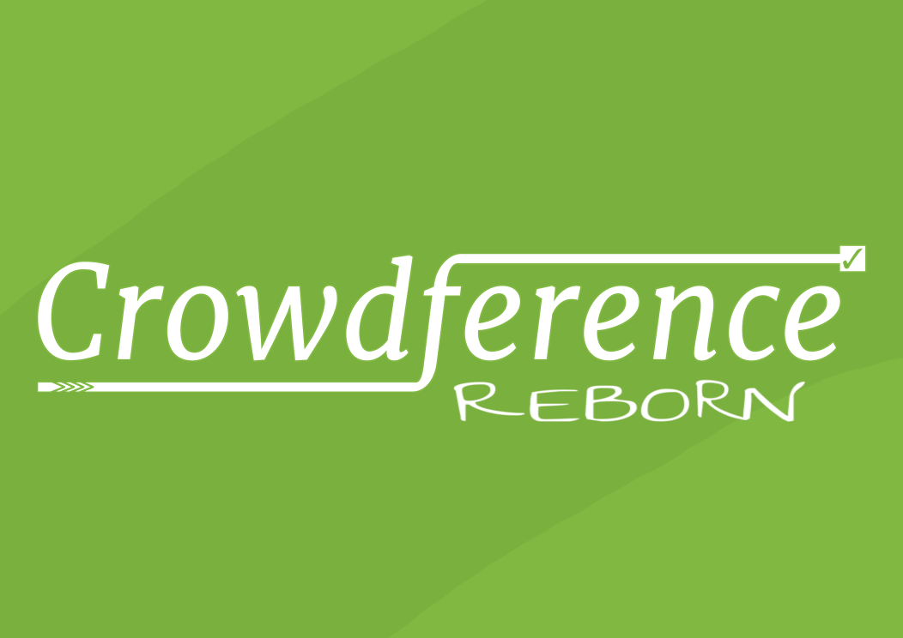

5 Años después, renace crowdference con un enfoque mucho más social que nunca, con nuevas funcionalidades y con importantes mejoras en la funcionalidad original.

## Funcionalidad Original:

Crowdference sirve para hacer a los políticos, empresas e instituciones aquellas preguntas que los medios de comunicación no se atreven a hacer.

Para que esto sea más efectivo hemos eliminado la necesidad de registrarse, tanto para preguntar como para contestar.

Crowdference ya no es una fuente primaria de contenido sino un agregador de contenido de redes sociales.

### Funcionamiento:

1. El usuario publica su pregunta en una o varias de las siguientes redes sociales.
    * facebook
    * twitter
    * youtube

2. Luego agrega su pregunta a crowdference, indicando un título y los enlaces correspondientes.
3. Crowdference mostrará el título, y el posts de la pregunta en cada red social, y en el caso de que haya respuesta, el post de la respuesta en las redes sociales donde se haya respondido.

### ¿Por qué?

El funcionamiento de Twitter y Facebook hace que las publicaciones sean muy efímeros debido al flujo constante de nuevo contenido. Por ello, son medios de comunicación dónde la ventana de impacto es muy corta, en los que _actualidad_ equivale a _presente inmediato_.

En tal contexto, un político, empresa o institución puede, ante una pregunta incómoda, ignorar la cuestión durante unas horas o días, y esperar a que caiga en el olvido.

Un agregador como crowdference dota a las redes sociales de memoria social.

## Nuevas funcionalidades:

### Carta Abierta:

Te permite enviar un correo a una dirección de correo, y hacer público su contenido, así como la respuesta que recibas. Todo ello integrado con las redes sociales.

### Peticiones:

Es cierto que ya existe change.org, pero son unos traficantes de datos que se aprovechan de la solidaridad de la gente.

crowdference.org no trafica con datos.
